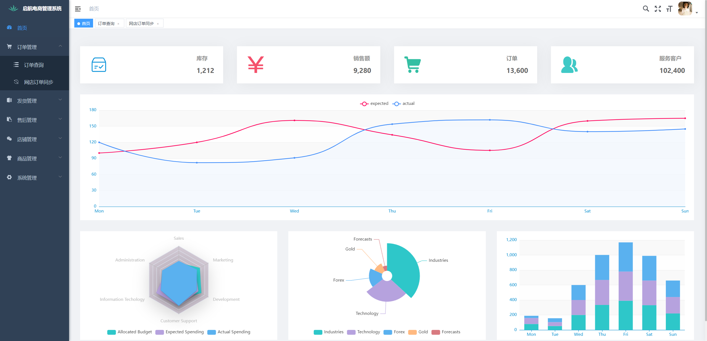

# 启航视频号电商系统

## 一、项目概述

启航视频号电商系统是一套为专为微信视频号小店开发的一套电商业务系统，支持多店铺管理。

主要功能：
+ 采购管理：采购下单、采购入库、采购费用记账等。
+ 订单管理：店铺订单同步、备注。
+ 发货管理：拣货出库、打包发货、物流跟踪、物流费用记账。
+ 售后管理：店铺售后同步、售后处理（补发商品、换货、退货）。
+ 库存管理：采购入库、发货出库、退货入库、库存明细。
+ 电子面单打印：订单发货打印。

基本覆盖视频号小店电商业务处理完整流程。

系统后端采用Springboot3开发，开源版本采用`H2`数据库，前端采用Vue2+Element开发。

## 二、功能列表
### 订单管理
#### 1、订单查询
+ 订单搜索： 管理已确认过的订单。
+ 订单详情：查看订单详情。
+ 手动关联订单商品（个别订单需要手动关联）
+ 添加订单赠品。
+ 选择订单发货方式（仓库发货、供应商发货）

#### 2、网店订单同步
+ API拉取订单： 使用微信视频号平台接口拉取店铺订单，支持多店铺。
+ 更新订单状态：可以单个更新订单状态，也可以批量更新订单状态。
+ 批量确认订单：批量确认订单，确认之后的订单才会入订单库。（确认订单会自动将店铺商品和ERP商品关联）

### 发货管理
#### 1、备货清单
+ 仓库发货备货清单：查看仓库发货需要备货的商品明细。
+ 供应商发货备货清单：查看需要供应商发货的商品明细。

#### 2、打包发货
选择店铺、订单号、快递公司、快递单号，进行发货处理。后续可以跟踪物流信息。

#### 3、快递公司管理
管理发货快递公司。

### 售后管理
#### 1、售后管理
+ 补发处理
+ 换货处理
+ 退货处理

#### 2、店铺售后同步
同步店铺售后数据。

### 店铺管理
#### 1、店铺商品管理
管理店铺的商品，使用微信视频号平台接口获取商品数据。

#### 2、店铺管理
对视频号小店进行管理，支持多店铺。

### 商品管理
#### 1、商品管理
对商品进行管理，维护：供应商、SKU、价格等信息。

#### 2、商品SKU管理
查询、维护商品SKU。

#### 3、商品分类管理
查询、维护商品分类。

#### 4、供应商管理
查询、维护供应商信息。

## 三、技术框架
**后端采用：**
+ Java 17
+ SpringBoot3.x

**数据库采用：**
`MySql`或`H2`

**缓存采用：**
`Caffeine`

**前端采用**
+ vue2
+ element

## 四、版本说明
| 功能       | 开源版  | 基础版  | 一件代发版 | 仓库发货版 | 电子面单版 | 旗舰版 |
|----------|------|------|-------|-------|-----|-----|
| 商品管理     | 支持   | 支持   | 支持    | 支持    | 支持  | 支持  |
| 供应商管理    | 支持   | 支持   | 支持    | 支持    | 支持  | 支持  |
| 店铺管理     | 支持   | 支持   | 支持    | 支持    | 支持  | 支持  |
| 店铺商品管理   | 支持   | 支持   | 支持    | 支持    | 支持  | 支持  |
| 订单管理     | 支持   | 支持   | 支持    | 支持    | 支持  | 支持  |
| 网店订单导入   | 支持   | 支持   | 支持    | 支持    | 支持  | 支持  |
| 发货管理     | 有限支持 | 有限支持 | 支持    | 支持    | 支持  | 支持  |
| 网店订单发货接口 | 不支持  | 不支持  | 支持    | 支持    | 支持  | 支持  |
| 拣货出库     | 不支持  | 不支持  | 不支持   | 支持    | 支持  | 支持  |
| 打包发货     | 有限支持 | 有限支持 | 支持    | 支持    | 支持  | 支持  |
| 物流费用     | 支持   | 支持   | 支持    | 支持    | 支持  | 支持  |
| 物流跟踪     | 支持   | 支持   | 支持    | 支持    | 支持  | 支持  |
| 供应商代发货   | 不支持  | 不支持  | 支持    | 支持    | 支持  | 支持  |
| 售后管理     | 支持   | 支持   | 支持    | 支持    | 支持  | 支持  |
| 采购管理     | 不支持  | 不支持  | 不支持   | 支持    | 支持  | 支持  |
| 库存管理     | 不支持  | 不支持  | 不支持   | 支持    | 支持  | 支持  |
| 电子面单打印   | 不支持  | 不支持  | 不支持   | 不支持   | 支持  | 支持  |

## 五、关注公众号

**作者微信公众号：qihangerp168**

💖 如果觉得有用记得点 Star⭐

